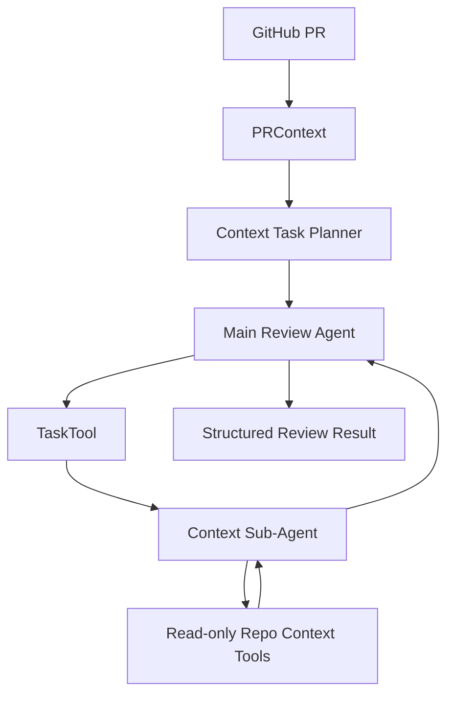
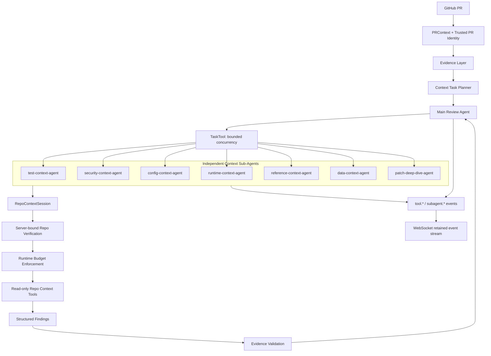
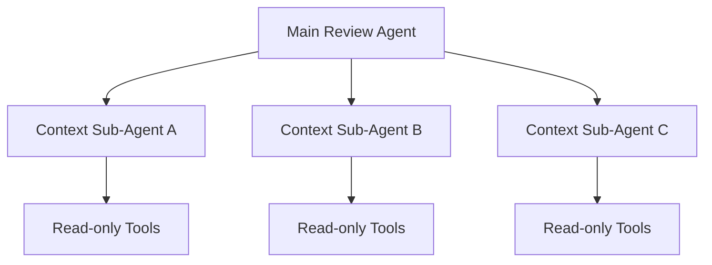

# PR Review 智能体编排优化策略

## 1. 文档目标

本文说明 PR-Copilot 的智能体编排如何从通用的代码审查流程，演进为面向 PR Review 垂直领域的受控多智能体系统。

重点回答以下问题：

- 原来的实现是什么样的。
- 当前实现优化了什么。
- 为什么这些优化适合 PR Review，而不是泛用聊天 Agent。
- 当前能力边界在哪里。
- 后续还可以如何继续演进。

本文聚焦后端智能体运行时、上下文任务规划、仓库上下文工具、审查结果约束和可观测性。

## 2. 核心判断

PR Review 不是开放式问答。它是一类需要高可信证据、严格控制成本、可追踪执行链路和稳定输出结构的工程任务。

一个适合 PR Review 的智能体系统，应当满足以下原则：

| 原则 | PR Review 中的含义 |
| --- | --- |
| 证据优先 | 每个可执行 finding 都要能回到文件、代码片段或工具结果 |
| 按需取上下文 | 不把整个仓库直接塞给模型，只围绕当前 PR 的风险点检索 |
| 任务边界清晰 | 子 Agent 只处理窄问题，不承担开放式递归规划 |
| 预算真实生效 | 搜索次数、文件数、token 使用量需要在运行时约束 |
| 身份可信 | 仓库、PR、commit 身份由服务端绑定，不交给模型决定 |
| 可观测 | 能看到子 Agent 和工具调用链路，方便调试、评估和产品展示 |
| 可降级 | 仓库上下文不可用时，仍可基于 diff 完成基础审查 |

这意味着 PR-Copilot 的编排目标不是让 Agent “尽可能自由”，而是让它在可信边界内获得足够的调查能力。

## 3. 演进概览

### 3.1 原始实现：围绕 Diff 的审查流水线

项目早期已经具备较好的 PR Review 基础：

- 将 GitHub PR 转换为统一的 `PRContext`。
- 生成 intake summary，理解改动意图和影响范围。
- 按风险对文件排序，优先审查高价值改动。
- 抽取仓库证据和规则。
- 使用结构化结果生成 review findings。

这个阶段的优势是主路径清晰，适合完成基础审查。但当 PR 较大、跨模块依赖较多时，仅依靠主 Agent 容易出现几个问题：

- 上下文过大，模型注意力被稀释。
- 检索范围缺少精细控制。
- 测试、配置、安全、运行时等不同风险混在一个推理过程里。
- 难以解释某个结论是如何产生的。

### 3.2 初版多智能体编排：拆分上下文调查任务

为了解决复杂 PR 的上下文调查问题，系统引入了上下文任务规划和专用子 Agent：



初版设计方向是正确的：

- 由 Planner 生成窄范围 `ContextTask`。
- 由 `TaskTool` 把调查任务分发给专用子 Agent。
- 子 Agent 使用只读仓库工具补充证据。
- 主 Agent 汇总上下文后输出最终审查结果。

但初版实现还有五个关键缺口：

| 缺口 | 表现 | 风险 |
| --- | --- | --- |
| 预算只停留在计划层 | Planner 生成预算，但工具运行时没有真正消费预算 | 大 PR 成本和延迟不可控 |
| Evidence 缺少代码级强约束 | Prompt 要求 evidence，但结果校验允许无证据 finding 通过 | 容易产生无法定位的审查结论 |
| 事件流不完整 | WebSocket 定义了事件类型，但运行时只发少量生命周期事件 | 前端和调试工具看不到真实执行链路 |
| 子 Agent 串行执行 | 独立任务逐个 `await` | 大 PR 延迟线性增长 |
| Repo verification 依赖模型输入 | verify 工具需要模型提供 owner/repo | 信任边界不够稳固 |

### 3.3 当前实现：受控、证据驱动的 PR Review Harness

当前版本在保留初版多智能体结构的基础上，补齐了运行时约束和可信边界：



当前系统可以概括为：

> 由主 Agent 控制审查方向，由专用子 Agent 并发调查上下文，由服务端约束身份和预算，由结果校验器阻止无证据 finding 进入最终审查。

## 4. 优化对比

| 维度 | 原来的实现 | 当前实现 | 带来的价值 |
| --- | --- | --- | --- |
| 审查方式 | 主 Agent 承担较多上下文理解 | 主 Agent 负责综合判断，子 Agent 负责窄范围调查 | 降低主上下文噪声 |
| 任务设计 | 有 Planner 和 budget 元数据 | budget 写入 `RepoContextSession` 并由工具消费 | 成本控制从描述变为运行时约束 |
| Finding 质量 | Prompt 鼓励提供 evidence | 可执行 finding 必须通过 evidence 校验 | 减少无法验证的结论 |
| 子 Agent 调度 | 串行执行 | 有上限并发执行，默认最多 4 个 | 降低大 PR 延迟 |
| 失败隔离 | 单个任务异常可能影响批次 | 兄弟任务异常隔离，保持稳定返回顺序 | 提升鲁棒性 |
| 仓库身份 | 模型参与提供 owner/repo | 服务端绑定可信 PR 身份，模型参数不可覆盖 | 收紧信任边界 |
| 仓库访问 | verification 约束不完整 | verify 失败后阻止仓库读取和搜索 | 避免访问错误上下文 |
| 可观测性 | 主要看到 started/completed/failed | 增加 `tool.call`、`tool.result`、`subagent.started`、`subagent.completed` | 便于调试、评估和前端展示 |
| 工具能力 | 只读上下文工具 | 继续保持只读，并增加 session 级限制 | 控制 Agent 行为面 |
| 降级策略 | 依赖仓库工具完成上下文获取 | verification 不通过时仍保留 diff-only 能力 | 外部上下文不可用时仍可完成基础 review |

## 5. 当前编排设计

### 5.1 主 Agent：综合判断与最终决策

主 Agent 是编排中心，主要负责：

- 理解 PR 的整体变更意图。
- 接收 Planner 生成的上下文任务。
- 调用 `TaskTool` 委派调查。
- 综合规则、diff、子 Agent 返回结果和工具证据。
- 生成结构化审查结果。

主 Agent 不需要直接完成所有仓库探索工作。它把有限上下文预算用于跨任务综合和 finding 决策。

### 5.2 Context Task Planner：把大问题拆成窄问题

Planner 生成的任务不是一句模糊的“检查一下仓库”，而是包含明确边界的上下文任务。

一个任务通常包含：

| 字段 | 作用 |
| --- | --- |
| `task_type` | 指定适合处理该问题的子 Agent 类型 |
| `source` | 当前 PR 中触发调查的来源 |
| `target` | 需要确认的上下文目标 |
| `queries` | 推荐执行的检索方向 |
| `budget` | 最大搜索次数、文件数和 token 数 |
| `expected_output` | 希望得到的证据或判断格式 |
| `fallback` | 上下文不足时的退化策略 |

这是一种适合 PR Review 的拆分方式：任务围绕具体风险点，而不是围绕开放式对话目标。

### 5.3 七类专用上下文子 Agent

系统使用固定类型的专用子 Agent，而不是让模型动态生成任意角色。

| 子 Agent | 主要职责 | 常见触发场景 |
| --- | --- | --- |
| `test-context-agent` | 查找相关测试、测试覆盖和回归风险 | 修改核心逻辑、修复 bug、变更边界条件 |
| `reference-context-agent` | 查找调用方、引用关系和受影响模块 | 修改公共函数、接口、配置键 |
| `security-context-agent` | 检查权限、输入验证、敏感数据和信任边界 | 鉴权、Webhook、凭据、外部输入 |
| `config-context-agent` | 检查配置项、默认值和环境差异 | 修改配置文件、环境变量、feature flag |
| `data-context-agent` | 检查 schema、持久化和数据兼容性 | 数据库、序列化、迁移、缓存结构 |
| `runtime-context-agent` | 检查异常处理、资源生命周期和运行时交互 | 并发、重试、超时、外部服务 |
| `patch-deep-dive-agent` | 对高风险 patch 做深入局部调查 | 复杂 diff、隐蔽控制流、跨文件行为变化 |

固定角色带来三个好处：

- Agent 能力和工具权限更容易审计。
- Prompt 更聚焦，输出更稳定。
- 后续评估可以按风险类别统计命中率和误报率。

### 5.4 树形编排，而不是自由递归

当前编排采用主 Agent 到子 Agent 的树形结构：



子 Agent 之间不直接通信，也不继续递归创建新的子 Agent。

这对 PR Review 很重要：

- 每条调查链路都能回溯到主 Agent 发出的任务。
- 不会出现无边界扩张的任务图。
- 易于并发、限流和失败隔离。
- 便于对每类任务单独做评估。

## 6. 本次关键优化

### 6.1 任务预算真正落到运行时

此前 Planner 已经生成 `max_searches`、`max_files`、`max_tokens`，但这些预算没有真正进入工具会话。当前实现增加了统一预算解析，并把任务预算写入 `RepoContextSession`。

运行时会约束：

- 最大搜索次数。
- 最大读取文件数。
- 最大 token 使用量。
- 本地工具和 provider-backed 工具的一致行为。
- 返回 manifest 和工具结果的体积。

预算异常时使用安全默认值，并拒绝无效的非正整数。

这项优化解决了大 PR 中最现实的问题：如果没有硬约束，Agent 会自然倾向于继续搜索，直到延迟、成本和上下文体积失控。

### 6.2 Finding 必须携带可验证证据

当前结果校验器对可执行 finding 增加了硬约束：

- 必须包含 evidence。
- evidence 必须包含文件路径。
- evidence 至少包含 `source` 或 `snippet` 之一。

这会把审查结论区分为两类：

| 类型 | 处理方式 |
| --- | --- |
| 有证据的可执行问题 | 进入 findings，供用户直接定位和修复 |
| 尚未验证的观察 | 保留为 note、uncertainty 或后续调查线索 |

这种约束很适合 PR Review。审查建议最终要落到代码行和修改动作上，无法回到证据的结论不应伪装成确定性 bug。

### 6.3 独立任务使用有上限并发

PR Review 的上下文任务大多是只读、彼此独立的。例如测试覆盖调查和配置兼容性调查通常可以同时进行。

当前 `TaskTool.run_many()` 使用 semaphore 控制并发，默认最多同时运行 4 个任务，并保持以下性质：

- 返回结果顺序与输入任务顺序一致。
- 单个子 Agent 异常不会中断整个批次。
- 并发规模有上限，避免 provider 和仓库工具被瞬间打满。

这不是简单地追求速度。更重要的是把任务图限制在可预测范围内，让延迟和资源压力更稳定。

### 6.4 Repo verification 改为服务端绑定身份

此前 verify 工具允许模型提供 owner/repo。虽然 Prompt 会要求模型正确调用，但模型不应该参与决定可信身份。

当前实现由服务端把 PR 身份注入工具会话：

- owner。
- repo。
- head SHA 等可信 PR 上下文。

模型仍可调用 verify 工具，但模型传入的身份不能覆盖服务端绑定值。

verification 失败后：

- 仓库读取和搜索工具会被阻止。
- diff-only 工具仍可使用。
- 系统可以退化为仅基于 PR patch 的审查。

这使信任边界更清晰：模型负责调查，服务端负责定义调查对象。

### 6.5 补齐运行时事件链路

系统原本已经定义了 WebSocket retained events，但运行时只发布少量生命周期事件。当前版本把工具调用和子 Agent 生命周期接入事件流。

主要事件包括：

| 事件 | 含义 |
| --- | --- |
| `started` | 主审查任务开始 |
| `tool.call` | Agent 准备调用工具 |
| `tool.result` | 工具调用返回摘要 |
| `subagent.started` | 子 Agent 开始执行 |
| `subagent.completed` | 子 Agent 完成 |
| `completed` | 主审查任务完成 |
| `failed` | 主审查任务失败 |

事件中保留必要元数据，例如：

- `agent_kind`。
- `agent_type`。
- `task_id`。
- `child_session_id`。

工具参数和结果经过摘要处理，避免把完整文件内容和大段上下文直接推送给前端。

这项能力同时服务三个方向：

- 前端可以展示真实的审查进度。
- 开发者可以定位慢任务和异常工具。
- 后续可以基于事件做离线评估和成本分析。

### 6.6 子 Agent 会话隔离

每个子 Agent 使用独立的 child session，任务 transcript、工具调用和上下文使用量相互隔离。

会话隔离的价值在于：

- 测试调查不会污染安全调查的上下文。
- 单个任务可以独立压缩和总结。
- 可以精确统计不同任务类型的成本。
- 后续可以按任务类型调整预算策略。

项目运行时已经具备 context compaction 能力。当前优化重点是把会话元数据和工具预算接好，为更精细的压缩策略打基础。

## 7. PR Review 垂直领域特化

### 7.1 Evidence-first，而不是 Answer-first

通用 Agent 往往优先回答用户问题，再补充依据。PR Review 更适合反过来：


没有足够证据时，系统应当降低结论强度，而不是提高措辞确定性。

### 7.2 On-demand Context，而不是全仓库灌入

PR Review 的上下文需求具有明显局部性：

- 修改函数时，需要调用方和测试。
- 修改配置时，需要默认值和部署环境。
- 修改数据结构时，需要读写链路和兼容性。
- 修改权限逻辑时，需要信任边界和外部输入来源。

因此系统使用任务驱动检索，只围绕当前风险点读取有限文件。这比一次性加载大量仓库内容更节省 token，也更容易追踪证据来源。

### 7.3 只读工具优先

上下文子 Agent 的目标是调查，不是修改仓库。默认只提供读取、搜索、引用查询和 verification 能力。

这使子 Agent 适合在自动审查链路中运行：

- 不会修改工作区。
- 不会执行开放式 shell 命令。
- 不会因为调查任务改变被审查对象。

未来如果引入本地测试执行，也应当只由主 Agent 在明确策略和权限控制下触发。

### 7.4 测试验证采用分层策略

PR Review 中的测试验证可以分为三层：

| 层级 | 目标 | 当前状态 |
| --- | --- | --- |
| CI/check 摘要 | 读取远程流水线状态和失败信息 | 已保留工具入口，当前仍是占位实现 |
| 测试上下文调查 | 查找相关测试文件、覆盖关系和缺失场景 | 已实现 |
| 本地测试执行 | 运行允许列表中的测试命令 | 后续能力，建议仅主 Agent 可触发 |

分层的意义是避免把“运行任意命令”过早开放给子 Agent，同时仍能获得足够的测试证据。

### 7.5 面向不确定性的降级路径

真实 PR Review 经常遇到以下情况：

- provider 暂时不可用。
- 仓库上下文 verification 失败。
- 某个子 Agent 超时。
- 文件预算耗尽。
- 相关测试不存在。

系统不应因为上下文调查不完整而完全停止。合理的降级路径是：

1. 优先使用 diff 和已收集证据完成基础 review。
2. 把未验证风险标记为 uncertainty。
3. 保留失败任务和工具事件，方便人工判断。
4. 避免把缺少证据的推测输出为确定性 finding。

## 8. 关键代码位置

| 模块 | 作用 |
| --- | --- |
| `backend/domain/review/context_task_planner.py` | 生成 PR Review 上下文任务和任务预算 |
| `backend/agent/subagents.py` | 定义子 Agent prompt、工具构造和任务会话注入 |
| `backend/agent/tools/task.py` | `TaskTool` 分发任务、并发控制和失败隔离 |
| `backend/agent/tools/repo_context/policy.py` | 解析并规范化任务预算 |
| `backend/agent/tools/repo_context/stateless_tools.py` | 执行只读仓库工具、预算扣减和 repo verification |
| `backend/agent/tools/repo_context/tool_defs.py` | 定义仓库上下文工具 schema |
| `backend/agent/runtime/loop.py` | Agent tool loop、回调和事件元数据 |
| `backend/agent/runtime/subagent_runner.py` | 子 Agent 生命周期、child session 和运行时事件 |
| `backend/agent/runtime/main_runner.py` | 主 Agent 运行和事件摘要发布 |
| `backend/agent/runtime/review_result.py` | 结构化审查结果校验和 evidence 约束 |
| `backend/agent/runtime/run_manager.py` | retained events 管理 |
| `backend/api/routes/review_ws.py` | WebSocket 事件转发 |

## 9. 测试覆盖

本次优化补充和更新了以下测试范围：

| 测试文件 | 覆盖内容 |
| --- | --- |
| `backend/tests/test_agent_runtime/test_task_tool.py` | 并发上限、顺序稳定性和失败隔离 |
| `backend/tests/test_agent_runtime/test_subagent_runner.py` | 子 Agent 生命周期事件和元数据 |
| `backend/tests/test_agent_runtime/test_main_runner.py` | 主 Agent 工具事件发布和摘要 |
| `backend/tests/test_agent_runtime/test_review_result.py` | finding evidence 强约束 |
| `backend/tests/test_agent_runtime/test_subagents.py` | session、预算和可信身份注入 |
| `backend/tests/test_repo_context.py` | repo context 会话行为 |
| `backend/tests/test_stateless_tools.py` | verification、读取门禁和预算扣减 |

完整后端测试结果：

```text
509 passed, 1 warning
```

现有 warning 来自 `fastapi.testclient` 使用的 Starlette 弃用提示，与本次智能体编排优化无关。

## 10. 当前边界

当前版本已经形成可用的 PR Review 编排基础，但还有一些适合后续演进的方向：

| 方向 | 当前状态 | 后续建议 |
| --- | --- | --- |
| CI/check 读取 | 工具入口存在，仍是占位实现 | 接入 GitHub Checks API，返回失败步骤和日志摘要 |
| 本地测试执行 | 尚未开放 | 使用允许列表、超时、资源限制和显式权限控制 |
| 符号级检索 | 目前以文件和文本搜索为主 | 增加 AST、调用图或语言服务器能力 |
| 语义检索 | 尚未接入 | 对大仓库引入 embedding 检索，并继续受任务预算约束 |
| 自动修复 | 当前聚焦 review | 将修复建议与代码修改分开，保留人工确认边界 |
| 输出修复 | 结构化校验已存在 | 对非法 JSON 或缺失字段增加有限次数 repair/retry |
| 评估体系 | 已有事件基础 | 建立按 Agent 类型统计的命中率、误报率、耗时和成本指标 |

## 11. 推荐的后续演进顺序

建议按以下顺序继续推进：

1. 接入真实的 GitHub Checks 摘要，提升测试结论可信度。
2. 基于 retained events 建立运行时指标，观察每类子 Agent 的耗时和预算消耗。
3. 对高频仓库增加符号级检索，减少文本搜索噪声。
4. 为无效结构化输出增加受限 repair/retry。
5. 在权限控制下增加主 Agent 触发的本地测试执行。
6. 使用真实 PR 数据集建立离线评估，持续校准误报率和召回率。

## 12. 总结

PR-Copilot 当前的智能体编排已经从“让模型审查代码”演进为“让模型在受控证据链路中审查代码”。

最关键的变化不是增加更多 Agent，而是建立了适合 PR Review 的工程约束：

- 子 Agent 有明确职责。
- 上下文任务有预算。
- 仓库身份由服务端绑定。
- 独立任务有上限并发。
- finding 必须附带证据。
- 执行链路可以观察和追踪。
- 外部上下文不可用时可以降级。

这些约束让系统更适合处理真实仓库中的复杂 PR，也为后续接入 CI、符号检索、评估体系和受控测试执行提供了稳定基础。
